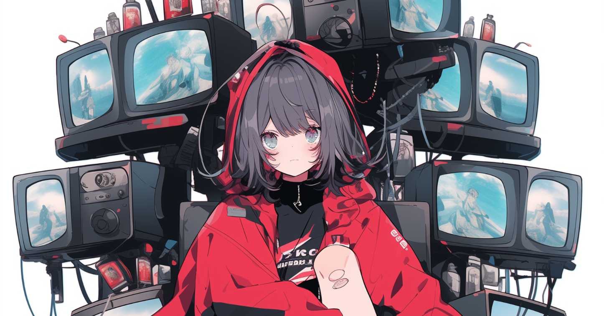

こんにちは、たっつー ( [@tatsutakein](https://twitter.com/tatsutakein) ) です。  
  
今期視聴しているアニメ多いな〜と思ったので、何を見ているかまとめてみました。  
順不同で羅列しています。

## Helck

実は 1 クール目のときに 1 話目で挫折していました。  
今回改めて 2,3 話くらいまで頑張ろうと思って見ていたらいつの間にか最新話まで追いついて漫画全巻買ってました。はて。

[https://www.helck-anime.com/](https://www.helck-anime.com/)

## ひきこまり吸血姫の悶々

[https://hikikomari.com/](https://hikikomari.com/)

## 呪術廻戦 懐玉・玉折／渋谷事変

声が付くと真人の邪悪さがより引き出されていいですね。

[https://jujutsukaisen.jp/](https://jujutsukaisen.jp/)

## 葬送のフリーレン

アニメ勢です。漫画も買おうかなぁ。

[https://frieren-anime.jp/](https://frieren-anime.jp/)

## 経験済みなキミと、経験ゼロなオレが、お付き合いする話。

毎回ダメージ受けながらみてます。

[https://kimizero.com/](https://kimizero.com/)

## 盾の勇者の成り上がり Season 3

[http://shieldhero-anime.jp/](http://shieldhero-anime.jp/)

## シャングリラ・フロンティア

漫画の単行本勢だったのですが、アニメーションで動くといいですね。

[https://anime.shangrilafrontier.com/](https://anime.shangrilafrontier.com/)

## Dr.STONE

今回アニメから入りました。  
1 期からみないとか〜〜〜と思いながら再生ボタンを押したら最新話までたどり着いていました。なんでだ。

[https://dr-stone.jp/](https://dr-stone.jp/)

## 陰の実力者になりたくて！ 2nd season

[https://shadow-garden.jp/](https://shadow-garden.jp/)

## ティアムーン帝国物語～断頭台から始まる、姫の転生逆転ストーリー～

ナレーションのツッコミがおもしろいです。

[https://tearmoon-pr.com/](https://tearmoon-pr.com/)

## 君のことが大大大大大好きな100人の彼女

キャラがかわいいのにおもしろくて好きですｗ

[https://hyakkano.com/](https://hyakkano.com/)

## デッドマウント・デスプレイ

[https://dmdp-anime.jp/](https://dmdp-anime.jp/)

## 聖女の魔力は万能です Season2

[https://seijyonomaryoku.jp/](https://seijyonomaryoku.jp/)

## 薬屋のひとりごと

漫画が 2 つあるとかでチラホラ話題は聞いていたのですが、今回アニメから入りました。  
薬でどうこうするだけのお話だと思っていたのですが、色々と考えさせられるお話ばかりで良きです。  
漫画買おうかと思うのですが、どっちを買えばいいんだろうｗ

[https://kusuriyanohitorigoto.jp/](https://kusuriyanohitorigoto.jp/)

## アンデッドアンラック

ジャンプ本誌で載っているので認知はしていたのですが、最初からみていなかったので内容を把握できていませんでした。  
それに伴って風子ちゃんのギャップがすごかったです。

[https://undead-unluck.net/](https://undead-unluck.net/)

## ダークギャザリング

めっっっっっっっっっっちゃダーク。

[https://darkgathering.jp/](https://darkgathering.jp/)
