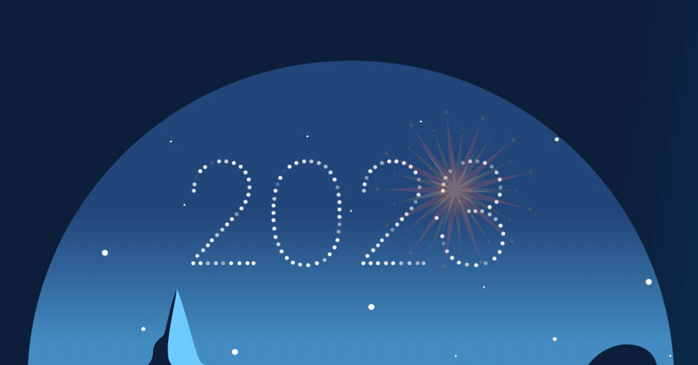

こんにちは、たっつー ( [@tatsutakein](https://twitter.com/tatsutakein) ) です。

私は突発性難聴をきっかけに健康を意識するようになり、2022 年から Oura リングを使用しています。

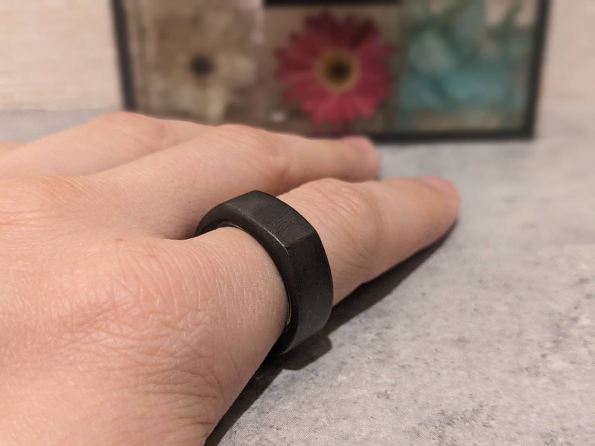

Oura リング

Oura リングには専用のアプリがあるのですが、最近アプリを起動したら Oura と歩んだ 2023 年というセクションが表示されていました。  
せっかくなので、振り返りがてらここに残そうと思います。

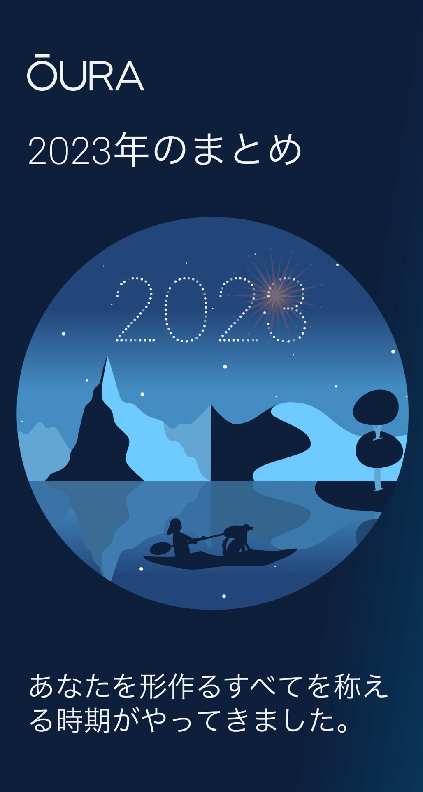

## アクティビティ

体を動かすのは好きなので、合っていそうです。

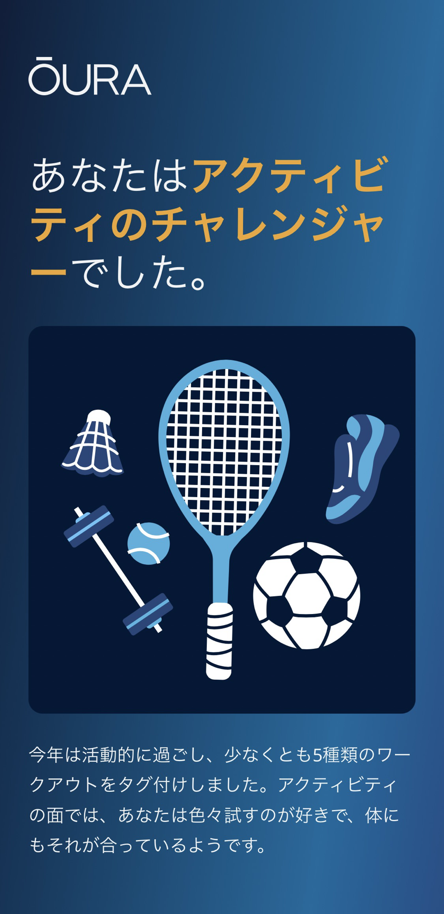

アクティビティのチャレンジャー

### アクティビティの実績

金曜日というのが意外でした 👀  
いつもトランポリンを実施していた土曜日だと思っていたのですが。

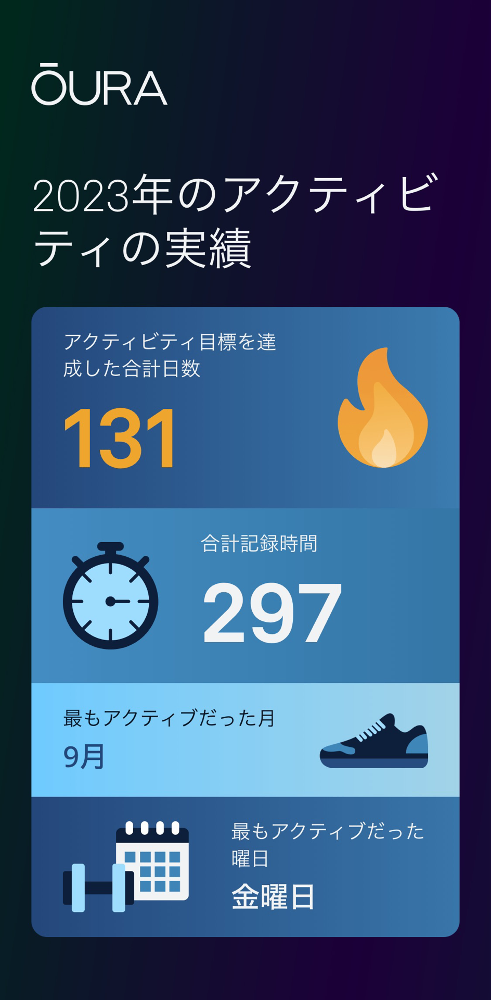

### アクティブな時間

いつもトランポリンする時間ですね 🤸

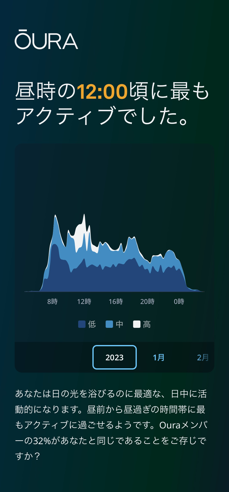

## 睡眠

### 平均睡眠時間

平均睡眠時間は 6 時間 53 分でした。  
これは少し短めだなと感じていますが、後述する昼寝をしているのでそれで多少取り戻せているのかなぁとも感じています。

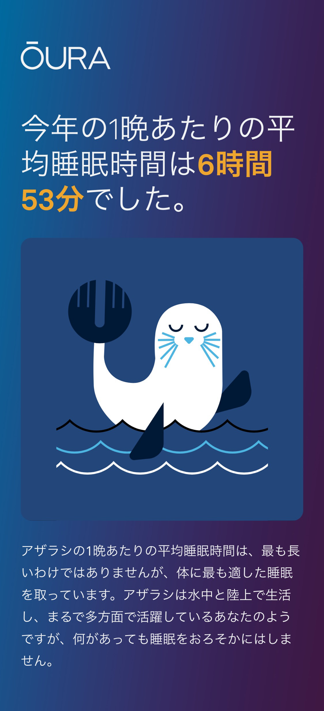

### 昼寝

実際にはもっと昼寝していたのですが、カウントされたのが 85 回でした。

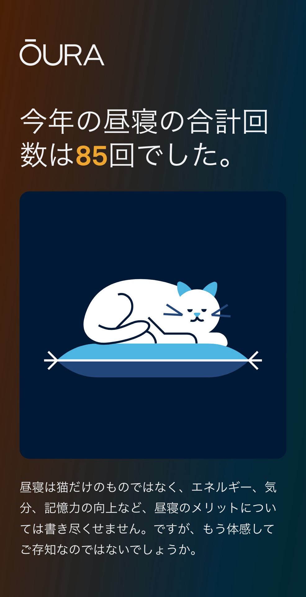

### 睡眠スケジュール

前職では出社時間が決まっていたので早めだったのですが、現職では自由になったため少しずつ 0時-9時で睡眠を取るように調整してました 👌

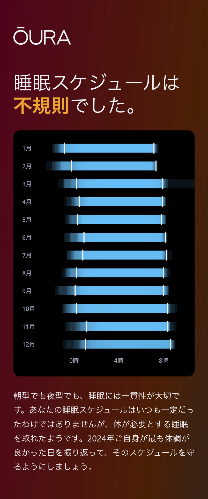

### 寝床にいた時間

起きる時間がなかなか変えられない…。（起きてしまう）

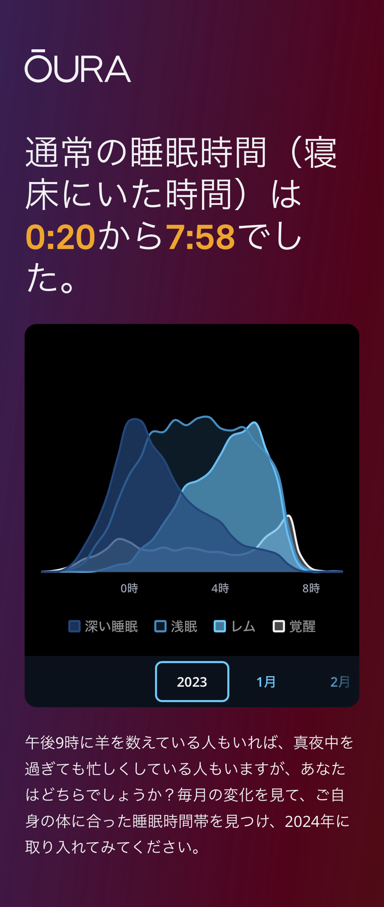

### 安静時心拍数

ここらへんはよくわからない 👀

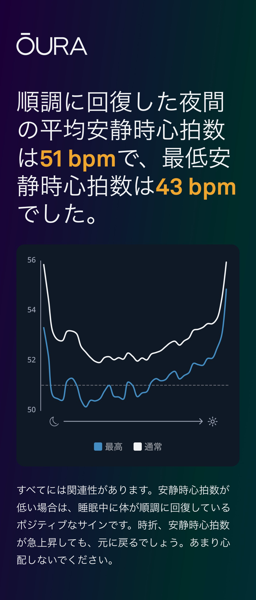

### 夜間の回復

ここもよくわからない 👀

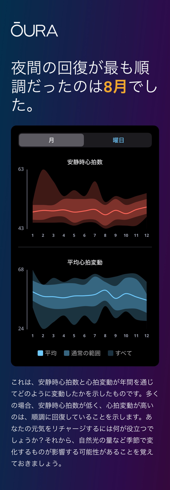

### 平均心拍変動

まあ良さそう…？

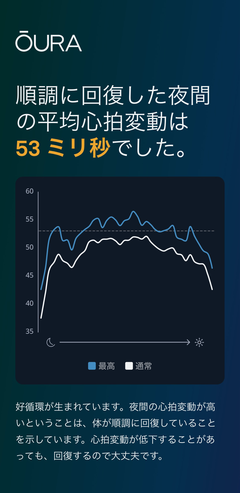

## まとめ

### スコアの変化

全体的にスコアが下がってきているので改善したいですね。

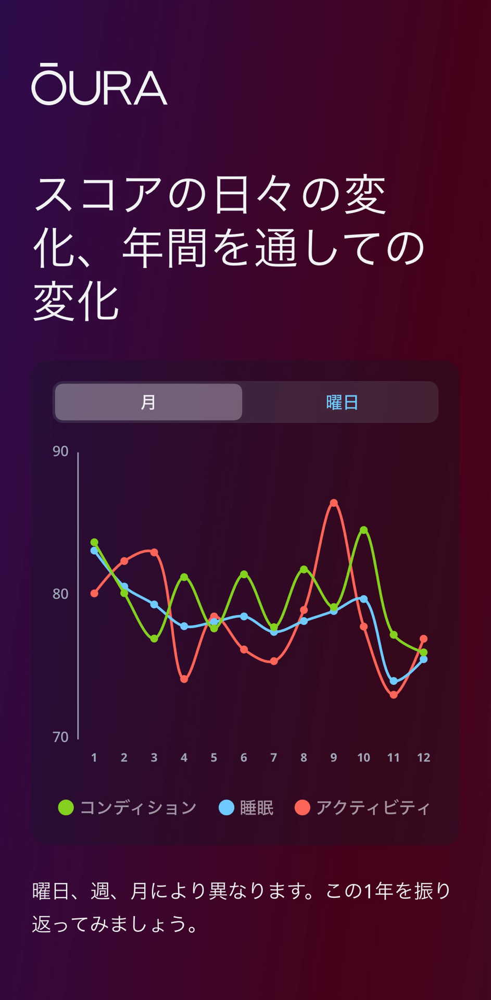

### Oura グランプリ

来年はもっと多く取りたいですね。

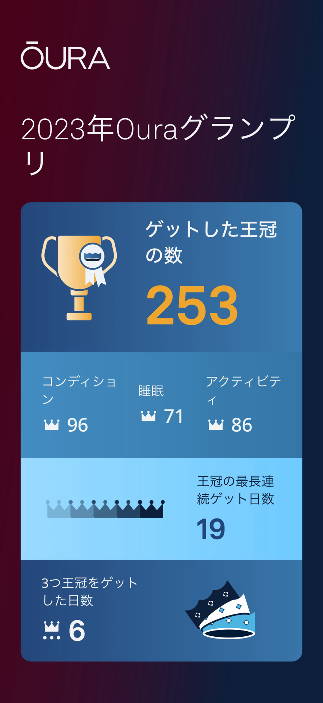

## おわりに

こういうのは継続的に計測していくのが大事だと思うので、引き続き使っていこうと思います 💪
